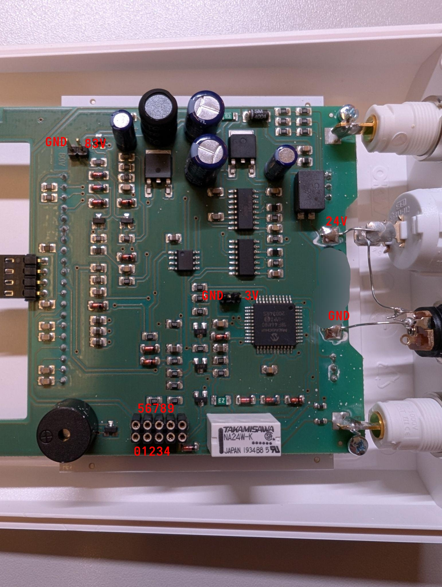
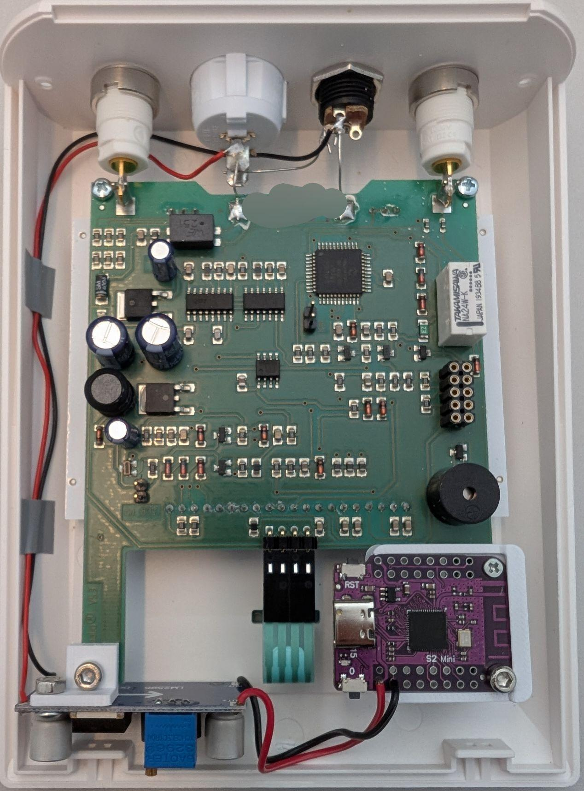

# saalio-smart (**work in progress**)

**Disclaimer: Use at your own risk, no guarantee or liability.** 

This project is an attempt to reverse engineer the saalio iontophoresis medical device. The procedure should be as minimally invasive as possible so that the functionality and safety of the device is not impaired in any way. \
The general motivation behind this is to track the therapy sessions so that they are not forgotten. It should also help to better understand the progress and success of the therapy.  \
\
The ultimate goal is to record all session data (duration, voltage, current, dc/ppm) into some kind of logging system. Two main logging options are offered:

1) Communication via. MQTT for use with e.g. HomeAssistant
2) Communication via. HTTP for use with InfluxDB and Grafana

*As a first step, and due to the lack of available analysis tools (e. g. an logic analyzer), **only the active status is logged for the time being**. An ESP32 (more precisely wemos s2 mini) is connected to the power source of the device so that it always starts automatically with a therapy session. This already provides basic functionality to track when therapy has taken place and is (imo) a huge advantage compared to taking notes manually.*

## Device hardware overview

* [saalio-iontophoresis-device](https://www.saalmann-medical.de/iontophorese/saalio-iontophorese-geraet/)
* VCC: 24V DC
* Max. Voltage for therapy: 58V
* Max. Current for therapy: 30mA
* DC and PPM
* PIC18F46K80

### 'Labeled' circuit board

### Modified board

### The "Debug" Pin-Layout (WIP)
| Pin | 0  | 1  | 2  | 3  | 4  |
|-----|----|----|----|----|----|
| Function | GND | ? | ? | ? | ? |

| Pin | 5  | 6  | 7  | 8  | 9  |
|-----|----|----|----|----|----|
| Function | VCC (24V) | ? | ? | ? | ? |

### Realizations
* Although the 'Kal Pin (next to the PIC)' supplies 3v and is therefore predestined to power the esp, the slightest change in voltage causes the device to reboot. Presumably, the 'Kal Pin' - as the name intends - is used to calibrate / control the internal voltages which is why we can't connect anything here.

## Used Hardware
* [Wemos S2 Mini (ESP32)](https://www.wemos.cc/en/latest/s2/s2_mini.html)
* [LM2596S DC-DC step down module](https://www.az-delivery.de/products/lm2596s-dc-dc-step-down-modul-1)
* [3D-Printed mount for the LM2596](hardware/models/lm2596_mount.stl)
* [3D-Printed mount for the S2 Mini](hardware/models/s2mini_mount.stl), credits: [printables.com](https://www.printables.com/model/1121556-wemos-s2-mini-mount/files)

## Used Software
* PlatformIO with esp-idf, make sure to select USB-CDC (not UART) in `pio run -t menuconfig`
